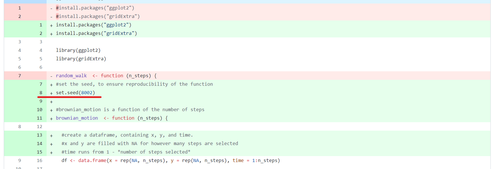

# Reproducible research: version control and R

Question 1, 2 and 3:
===

Answers located in the 'README.md' file of my logistic growth repository, located here: https://github.com/yarn-lover/logistic_growth/tree/main

Question 4:
===

a) The plots show the paths of the 2 different random walks, represented by a line. The colour of the line indicates represents the timestep that generated that position: the lighter the blue, the greater the timestep. Both random walks start from coordinate (0,0), as specified in the random_walk() function.

A comparison of the 2 walk paths: Introducing the same x & y limits for the graphs helps to compare them to each other. The paths are clearly different, and both walks appear random, looping back on themselves often, although they both start off with an earlier slightly more directional period, and a later period staying around the same area. They also both cover roughly the same range of distance ( ~4 x units and ~10 y units), but these similarities are coincidences, since the walks were produced by a random function.

Although the underlying code to produce both random walks is the same, the two walks show different paths, because each time the function runs, it is generating different coordinates, due to the runif() function, which generates a random number each time it is run. Therefore, it is not a reproducible way to simulate the random process, as if anyone tries to reproduce it, they will produce a different path.

b) A random seed refers to a number that is fed into a series of deterministic algorithms, producing a sequence of numbers that appears random but actually are not. The sequence produced is therefore specific to the starting value that is provided by the user (the seed). This means that anyone who uses the same initial seed will be able to generate the exact same seemingly random series of numbers. This has a number of applications, including creating reproducible analyses that require effectively random numbers.

d) Show the edit made to make a reproducible simulation of Brownian motion:

note: I also made a number of other edits to this file, such as commenting on what each line of code was doing, so there are a number of green lines here, but the key addition to make the simulation reproducible is underlined in red in this image. This addition (set.seed(8002)) was also included before creating the second simulation further down the script, to ensure that the second simulation would produce the same path as the first.

The edit can also be directly viewed in the file 'random_walk.R' located in the folder 'question-4-code'

Question 5
===

a) there are 33 rows and 13 columns in the table

b) perform a log transformation on the relationship, to form lnV = lnβ + α*lnL  

This is a linear equation: lnβ is the intercept and α is the gradient

Transforming the data in this way means we can now fit a linear model to the data to estimate the value of α and β.

c) summary output of linear model:

intercept estimate = lnβ = 7.0748, so **β = exp(7.0748)** = 1,181.807; p-value 2.28e-10 (this is statistically significant, as p-value < 0.05)

gradient estimate = **α = 1.5152**; p-value 6.44e-10 (this is statistically significant, as p-value < 0.05)

Comparison to table 2 of paper: 

Table values: exponent (α): 1.52; scaling factor (β): 1,182. These are the same values that I obtained, when rounded to the same number of significant figures. This indicates that this part of the paper was reproducible from the dataset that they provided. 

d) code for the graph is here, and also located in script 'viral_volume_analysis.R', found in folder 'question-5-data' of the project

ggplot(aes(log(Genome.length..kb.),log(Virion.volume..nm.nm.nm.)), data = viral_data)+

  geom_smooth(method = "lm")+
  
  geom_point()+
  
  labs(x="log[Genome length (kb)]", y="log [Virion volume (nm3)]")+
  
  theme_bw()
  
e) **$`V = \beta L^{\alpha}`$**, where β = exp(7.0748), α = 1.5152, volume is measured in nm^3, length is measured in kb

so for L = 300, V = exp(7.0748) * (300^1.5152) = **6697007nm^3**

Bonus question: difference between reproducibility and replicability
===

Reproducibility and replicability have been used to mean different things by different groups of people. Reproducibility can usefully be defined as where an original researcher provides their data and coding analysis used to reach a set of results with 'sufficient transparency and clarity' that a second researcher can reach the same results by using that data and analysis (National Academies of Science et al. 2019). Replicability can then be defined as collecting new data / carrying out a new study investigating the same / similar question as a previous study, either 'using the same, or different methods and conditions of analysis', and either being carried out by the same original scientists, or new scientists (National Academies of Science et al. 2019).

git and GitHub enable researchers to publicly publish their data along with their coding analysis, for other researchers to look at. This enables reproducibility, as other researchers can easily download their data and code, and run the analyses themselves, allowing them to check code is accurate and ensure they can reach the same results using their analyses - this is reproducibility. It can also aid repeatability, as new researchers can access information from original analyses, such as the methods and analysis techniques used, which can inform the analysis methods new researchers may choose when attempting to repeat a study themselves. Limitations of GitHub include that repositories are usually collections of files used in coding analyses or software development, whereas some platforms for reproducible science allow more integrated descriptions of entire protocols used for studies. For instance, protocol.io is a platform that can enable researchers to outline the entire protocols used for their study, linking to various relevant files along the way. Therefore, it can ensure reproducibility and repeatability of all of the methods used by a particular study, rather than primarily only coding sections, as GitHub is primarily used for. Therefore, overall, GitHub is very useful for achieving reproducibility and repeatability of the results of coding analyses, but is more limited when it comes to increasing reproducibility and repeatability over *all* the protocols used by a particular study.

References: 

1: National Academies of Sciences, Engineering, and Medicine; Policy and Global Affairs; Committee on Science, Engineering, Medicine, and Public Policy; Board on Research Data and Information; Division on Engineering and Physical Sciences; Committee on Applied and Theoretical Statistics; Board on Mathematical Sciences and Analytics; Division on Earth and Life Studies; Nuclear and Radiation Studies Board; Division of Behavioral and Social Sciences and Education; Committee on National Statistics; Board on Behavioral, Cognitive, and Sensory Sciences; Committee on Reproducibility and Replicability in Science. Reproducibility and Replicability in Science. Washington (DC): National Academies Press (US); 2019 May 7. 3, Understanding Reproducibility and Replicability. Available from: https://www.ncbi.nlm.nih.gov/books/NBK547546/

## Instructions

The homework for this Computer skills practical is divided into 5 questions for a total of 100 points (plus an optional bonus question worth 10 extra points). First, fork this repo and make sure your fork is made **Public** for marking. Answers should be added to the # INSERT ANSWERS HERE # section above in the **README.md** file of your forked repository.

Questions 1, 2 and 3 should be answered in the **README.md** file of the `logistic_growth` repo that you forked during the practical. To answer those questions here, simply include a link to your logistic_growth repo.

**Submission**: Please submit a single **PDF** file with your candidate number (and no other identifying information), and a link to your fork of the `reproducible-research_homework` repo with the completed answers. All answers should be on the `main` branch.

## Assignment questions 

1) (**10 points**) Annotate the **README.md** file in your `logistic_growth` repo with more detailed information about the analysis. Add a section on the results and include the estimates for $N_0$, $r$ and $K$ (mention which *.csv file you used).
   
2) (**10 points**) Use your estimates of $N_0$ and $r$ to calculate the population size at $t$ = 4980 min, assuming that the population grows exponentially. How does it compare to the population size predicted under logistic growth? 

3) (**20 points**) Add an R script to your repository that makes a graph comparing the exponential and logistic growth curves (using the same parameter estimates you found). Upload this graph to your repo and include it in the **README.md** file so it can be viewed in the repo homepage.
   
4) (**30 points**) Sometimes we are interested in modelling a process that involves randomness. A good example is Brownian motion. We will explore how to simulate a random process in a way that it is reproducible:

   - A script for simulating a random_walk is provided in the `question-4-code` folder of this repo. Execute the code to produce the paths of two random walks. What do you observe? (10 points)
   - Investigate the term **random seeds**. What is a random seed and how does it work? (5 points)
   - Edit the script to make a reproducible simulation of Brownian motion. Commit the file and push it to your forked `reproducible-research_homework` repo. (10 points)
   - Go to your commit history and click on the latest commit. Show the edit you made to the code in the comparison view (add this image to the **README.md** of the fork). (5 points)

5) (**30 points**) In 2014, Cui, Schlub and Holmes published an article in the *Journal of Virology* (doi: https://doi.org/10.1128/jvi.00362-14) showing that the size of viral particles, more specifically their volume, could be predicted from their genome size (length). They found that this relationship can be modelled using an allometric equation of the form **$`V = \beta L^{\alpha}`$**, where $`V`$ is the virion volume in nm3 and $`L`$ is the genome length in nucleotides.

   - Import the data for double-stranded DNA (dsDNA) viruses taken from the Supplementary Materials of the original paper into Posit Cloud (the csv file is in the `question-5-data` folder). How many rows and columns does the table have? (3 points)
   - What transformation can you use to fit a linear model to the data? Apply the transformation. (3 points)
   - Find the exponent ($\alpha$) and scaling factor ($\beta$) of the allometric law for dsDNA viruses and write the p-values from the model you obtained, are they statistically significant? Compare the values you found to those shown in **Table 2** of the paper, did you find the same values? (10 points)
   - Write the code to reproduce the figure shown below. (10 points)

  

     
  

  - What is the estimated volume of a 300 kb dsDNA virus? (4 points)

**Bonus** (**10 points**) Explain the difference between reproducibility and replicability in scientific research. How can git and GitHub be used to enhance the reproducibility and replicability of your work? what limitations do they have? (e.g. check the platform [protocols.io](https://www.protocols.io/)).
