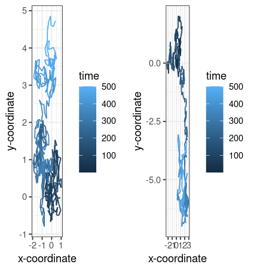
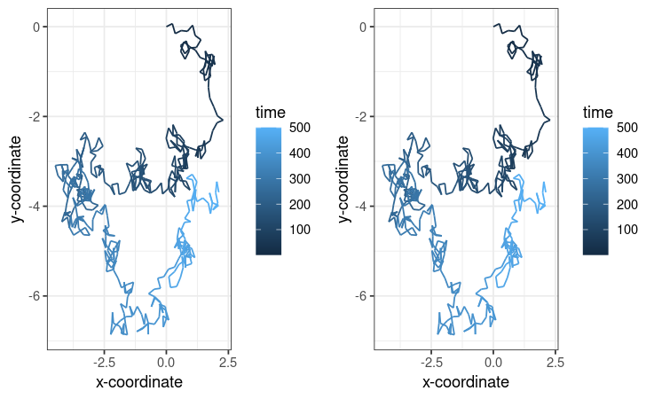
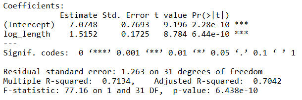
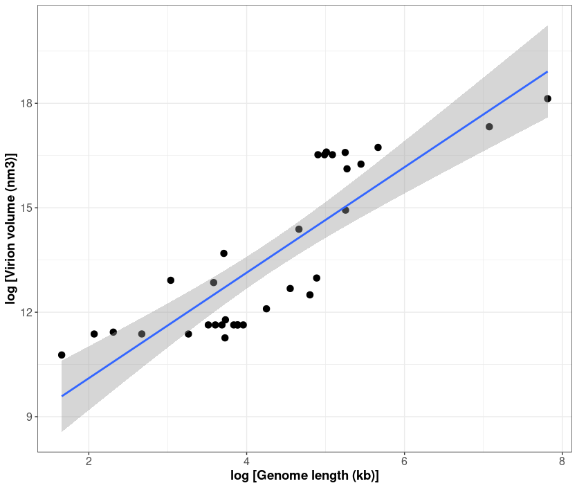
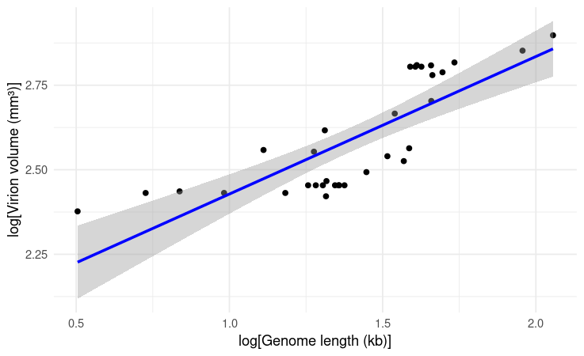

# Reproducible research: version control and R

### Q1), Q2), Q3) from logistic_growth data:

<https://github.com/annon64/logistic_growth/tree/dev>

### Question 4: Simulating Randomness using Brownian motion

Figure5: Output of question-4-code simulating a random walk:



### a) Give observations of random-walk patterns

When executing the code, we can see that two adjacent graphs are simulated, displaying distinct random walk patterns, despite using the exact asame functions and code for their generation. The heat bar on the side refers to number of steps simulated (0-500) in the random_walk function with n_steps for each graph. Variation in the two walk paths is generated by the code randomly sampling the angle (radians) taking each step, between 0 ad 2*(pi).* The path iterates from 2 to n_steps, with step size 'h' of 0.25. For each step, the next x-coordinate is computed using the previous x-coordinate plus 'cos(angle)\*h*'* and the next y-coordinate is computed using the previous y-coordinate plus 'sin(angle)\*h. The plots are generated with the random walk data for 500 steps by calling the 'random_walk(500)' function, and plots generates as 'plot1' and 'plot2' using 'ggplot'. Time is visually represented using the gradient scale to the right of each side by side plot. Despite using the same random functions, the two graphs produce discrete walk paths, with the left hand plot occupying a larger range of space along the x- and y-axes compared to the narrower path of the right hand plot. The two movement patterns also start at different areas of the graph, with the left hand plot starting its walk at the top left of the plot, and the right hand plot starting in the bottom right, as indicated by the darkest lines (starting from first step).

### b) Investigate the term random seeds. What is a random seed and how does it work?

In the context of Brownian systems (deterministic continuous dynamical systems with random changes over time), a random seed is an initial vector or number that is used to generate a pseudo-random number generator (PRNG) (Gerardo de la Fraga, 2023). This d. This produces a deterministic system based on the initial starting values (seed). PRNGs produce the same sequence of random numbers determined by a starting condition (name seed). This system enables the generation of reproducible random sequences by specifying t

R uses the 'set.seed(value)' function before generating a random number to initialise the random number generator. After setting the start seed, reproducibility is enabled as functions using the same seed will produce the same random numbers in subsequent runs.

### c) Edit the script to make a reproducible simulation of Brownian motion. Commit the file and push it to your forked reproducible-research_homework repository:

Figure 6: output of random seed generated reproducible random walk data



Edited code to add a random seed function (set.seed()):

```{r}
library(ggplot2)
library(gridExtra)

random_walk <- function(n_steps) {
  
  df <- data.frame(x = rep(NA, n_steps), y = rep(NA, n_steps), time = 1:n_steps)
  
  df[1,] <- c(0,0,1)
  
  for (i in 2:n_steps) {
    
    h <- 0.25
    
    angle <- runif(1, min = 0, max = 2*pi)
    
    df[i,1] <- df[i-1,1] + cos(angle)*h
    
    df[i,2] <- df[i-1,2] + sin(angle)*h
    
    df[i,3] <- i
  }
  
  return(df)
}

# Setting a random seed
set.seed(64)
data1 <- random_walk(500)

plot1 <- ggplot(aes(x = x, y = y), data = data1) +
  geom_path(aes(colour = time)) +
  theme_bw() +
  xlab("x-coordinate") +
  ylab("y-coordinate")

# Setting a random seed
set.seed(64)
data2 <- random_walk(500)

plot2 <- ggplot(aes(x = x, y = y), data = data2) +
  geom_path(aes(colour = time)) +
  theme_bw() +
  xlab("x-coordinate") +
  ylab("y-coordinate")

# Arrange and display the plots
grid.arrange(plot1, plot2, ncol = 2)
```

### d) View of committed Question_4_script.R in GitHub commit history:


# Question 5:

### a) Data for double-stranded DNA (dsDNA) virus data imported.

Table has 33 data entries (34 rows in table total including headings) and 13 columns.

### b) What transformation can you use to fit a linear model to the data? Apply the transformation.

As stated in question 5, the relationship between virion volume (V) and genome length (L) is:

1)  $`V = \alpha L^{\beta}`$

This is a non-linear relationship. The exponential relationship can be transformed to fit a linear model using a log transformation, which will convert the original relationship  ***V=αLβ,*** into ***log(V) = B \* log(L) + log(a)***.

This transformation can be achieved using the following code

```{r}
# Question 5 script:
  
# Loading libraries
library(dplyr)  # data manipulation
library(readr)  # reading CSV files

# Specifying the working directory to location of .csv file
setwd("/cloud/project/question-5-data")

getwd()  

# Reading the .CSV file
Q5_Data <- read_csv("Cui_etal2014.csv")

##  Question 5) a

# Print and view the data 
print(head(Q5_Data))

View(Q5_Data)

# Check dimensions of the full dataset
full_dim <- dim(Q5_Data)
print(full_dim)  # collumn number: 13, row number: 33

## Question 5) b
# Applying the log transformation

data_logged <- data %>% 
  mutate(log_volume = log(`Virion volume (nm×nm×nm)`), log_length = log(`Genome length (kb)`))

# View log-transformed data
print(head(data_logged))
full_dim_log <- dim(data_logged)
print(full_dim_log)

# If you want to save the transformed data to a new CSV file
write_csv(data_logged, "Cui_etal2014_log_transformed.csv")
```

### c)

The exponent ($\beta$) and scaling factor ($\alpha$) of the allometric law for dsDNA viruses can be found from the linear, log transformed model by using R to estimate the functions slope ($\beta$) and intercept ($\alpha$).

Fitting the linear model (linear_logged_model) and using the summary function to view the intercepts and p-values produces the following output in the console:

{width="458"}

Slope ($\beta$) estimate is the log_length coefficient: 1.5152

Logged Intercept ($\alpha$) estimate is (Intercept) coefficient: 7.0748, which can be back-transformed by finding *e*^7.0748^ = 1181.807

Therefore:

($\beta$) = **1.5152,** with p-value **6.44 x 10^10^**, which is statistically significant with significance level: ***P*** **\< 0.001**

($\alpha$) = **1181.807**, with p-value **2.28 x 10^10^**, which is statistically significant with significance level: ***P*** **\< 0.001**

Table 2 of 'An Allometric Relationship between the Genome Length and Virion Volume of Viruses' states that for dsDNA Viruses:

The Allometric exponent (95% CI) is: 1.52 (1.16-1.87)

The Scaling Factor (95% CI) is: 1,182 (246-5,675)

Both these results align with the coefficients calculated by the linear model.

### d) Write the code to reproduce the figure shown below:



The figure above shows a scatter plot with fitted regression line. The x-axis shows the logarithm of (viral) genome length (kilobases, kb), against the y-axis, the logarithm of virion volume (mm^3^ ). The blue line appears to represent a linear regression model fitted to the black data points, with the confidence intervals of the regression plot represented by the surrounding shaded-grey area. The plot appears to show a positive relationship between logarithm genome length and logarithm virion volume.

To reproduce this graph, we can use the previously fitted linear model of the log-transformed variables using the ggplot() package as follows:

```{r}
## Question d) Generating the model

# Loading required library
library(ggplot2)

# using the linear model above:
linear_logged_model <- lm(log_volume ~ log_length, data = data_logged)

# Create the plot
ggplot(linear_logged_model, aes(x = log(log_length), y = log(log_volume))) +
  geom_point(color = "black") +  # Scatter points
  geom_smooth(method = "lm", se = TRUE, color = "blue") +  # Regression line with confidence interval
  labs(x = "log[Genome length (kb)]", y = "log[Virion volume (mm³)]") +  # Axis labels
  theme_minimal()  # Clean theme
```

Which produces this plot: Figure7



### e) what is the estimated volume of a 300 kb dsDNA virus

As stated in question 5, the relationship between virion volume (V) and genome length (L) is:

1)  $`V = \alpha L^{\beta}`$

V is unknown, L = 300kb, ($\beta$) = 1.5152, ($\alpha$) = 1181.807

we must substitute the known values into the equation to obtain an estimate for Virion Volume (V)

**V = 1181.807 x 300^1.5152^ = 6697009 nm^3^**

Reference:

The \`echo: false\` option disables the printing of code (only output is displayed). [Generating pseudo-random numbers with a Brownian system](https://solo.bodleian.ox.ac.uk/discovery/fulldisplay?docid=cdi_crossref_primary_10_1016_j_vlsi_2023_102135&context=PC&vid=44OXF_INST:SOLO&lang=en&adaptor=Primo%20Central&tab=Everything&query=any%2Ccontains%2CGenerating%20pseudo-random%20numbers%20with%20a%20Brownian%20system) de la Fraga, Luis Gerardo ; Ovilla-Martínez, Brisbane, Elsevier B.V, 2024-05, Vol.96, p.102135, Article 102135

## Instructions

The homework for this Computer skills practical is divided into 5 questions for a total of 100 points. First, fork this repo and make sure your fork is made **Public** for marking. Answers should be added to the \# INSERT ANSWERS HERE \# section above in the **README.md** file of your forked repository.

Questions 1, 2 and 3 should be answered in the **README.md** file of the `logistic_growth` repo that you forked during the practical. To answer those questions here, simply include a link to your logistic_growth repo.

**Submission**: Please submit a single **PDF** file with your candidate number (and no other identifying information), and a link to your fork of the `reproducible-research_homework` repo with the completed answers (also make sure that your username has been anonymised). All answers should be on the `main` branch.

## Assignment questions

1)  (**10 points**) Annotate the **README.md** file in your `logistic_growth` repo with more detailed information about the analysis. Add a section on the results and include the estimates for $N_0$, $r$ and $K$ (mention which \*.csv file you used).

2)  (**10 points**) Use your estimates of $N_0$ and $r$ to calculate the population size at $t$ = 4980 min, assuming that the population grows exponentially. How does it compare to the population size predicted under logistic growth?

3)  (**20 points**) Add an R script to your repository that makes a graph comparing the exponential and logistic growth curves (using the same parameter estimates you found). Upload this graph to your repo and include it in the **README.md** file so it can be viewed in the repo homepage.

4)  (**30 points**) Sometimes we are interested in modelling a process that involves randomness. A good example is Brownian motion. We will explore how to simulate a random process in a way that it is reproducible:

    a)  A script for simulating a random_walk is provided in the `question-4-code` folder of this repo. Execute the code to produce the paths of two random walks. What do you observe? (10 points)\
    b)  Investigate the term **random seeds**. What is a random seed and how does it work? (5 points)\
    c)  Edit the script to make a reproducible simulation of Brownian motion. Commit the file and push it to your forked `reproducible-research_homework` repo. (10 points)\
    d)  Go to your commit history and click on the latest commit. Show the edit you made to the code in the comparison view (add this image to the **README.md** of the fork). (5 points)

5)  (**30 points**) In 2014, Cui, Schlub and Holmes published an article in the *Journal of Virology* (doi: <https://doi.org/10.1128/jvi.00362-14>) showing that the size of viral particles, more specifically their volume, could be predicted from their genome size (length). They found that this relationship can be modelled using an allometric equation of the form $`V = \alpha L^{\beta}`$, where $`V`$ is the virion volume in nm<sup>3</sup> and $`L`$ is the genome length in nucleotides.

    a)  Import the data for double-stranded DNA (dsDNA) viruses taken from the Supplementary Materials of the original paper into Posit Cloud (the csv file is in the `question-5-data` folder). How many rows and columns does the table have? (3 points)\
    b)  What transformation can you use to fit a linear model to the data? Apply the transformation. (3 points)\
    c)  Find the exponent ($\beta$) and scaling factor ($\alpha$) of the allometric law for dsDNA viruses and write the p-values from the model you obtained, are they statistically significant? Compare the values you found to those shown in **Table 2** of the paper, did you find the same values? (10 points)\
    d)  Write the code to reproduce the figure shown below. (10 points)

<p align="center">


</p>

e)  What is the estimated volume of a 300 kb dsDNA virus? (4 points)
